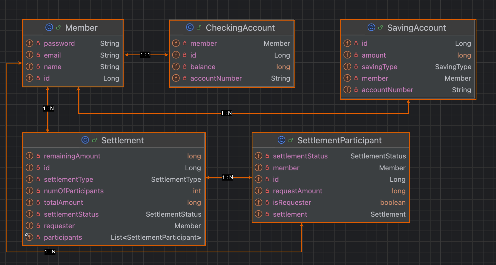

# MiniPay
카카오페이와 같이 친구에게 송금하고 정산하는 기능이 있는 페이 서비스입니다. 현재 구현중에 있습니다.

## 개발 환경
- Java 17
- Spring boot 3.3.1
- Gradle 8.8
- Spring data JPA, QueryDSL
- H2 database, Redis
- JUnit 5, Mockito, RestAssured
- Sonarqube, jacoco

## 엔티티 설계

- 계좌 엔티티
  - 회원은 하나의 메인 계좌(CheckingAccount)를 가질 수 있습니다.
  - 회원은 여러개의 적금 계죄(SavingAccount)를 가질 수 있습니다.
  - 메인, 적금 계좌는 회원과의 관계도 다르고, 역할이 다르기 때문에 상속관계로 두지 않고 별도의 엔티티로 취급하였습니다.
- 정산(Settlement) 엔티티
  - 회원은 정산을 여러번 요청할 수 있습니다.
  - 정산에 참여하는 참여자에 대한 정보를 저장하기 위해 참여자(SettlementParticipant) 엔티티를 추가하였습니다.

## 프로젝트 기능
[회원 가입 및 로그인]
- 회원 가입 시 이메일 인증을 통해 검증합니다. (예정)
- 회원을 등록할 때 메인 계좌를 생성합니다.
- 로그인에 성공하고 나면 인증 토큰을 발급합니다. (예정)

[충전하기]
- 외부 계좌를 통해 메인 계좌에 충전할 수 있습니다.
- 1일 충전 한도는 3,000,000원입니다.

[송금하기]
- 나의 메인 계좌에서 친구 메인 계좌로 송금할 수 있습니다.
- 송금 시 잔액이 부족하다면 자동 충전됩니다.
  - 충전 단위는 10,000원입니다.
- 1일 충전 한도는 3,000,000원입니다.
- 송금 사용자의 설정에 따라 송금 방식을 결정할 수 있습니다. (예정)
  - 설정: 즉시 송금(default), Pending 송금(금액을 받는 사람이 확인해야만 송금 완료)
- 송금 완료 및 요청 시 알림을 발송합니다. (예정)

[적금하기]
- 메인 계좌에서 인출하여 적금 계좌에 납입할 수 있습니다.
- 메인 계좌의 잔액이 부족하면 돈을 인출할 수 없습니다.
- 주기적으로 이자가 입금됩니다. (예정)
  - 적금 상품에 따라 주기와 이율이 다릅니다.
  - 적금 상품: 정기 적금, 자유 적금

[정산하기]
- 정산을 요청할 수 있습니다.
  - 정산 타입: 더치패이(1/n 정산), 랜덤 정산(금액을 무작위로 분배)
- 정산 요청을 하면 참여자들에게 알림을 발송합니다. (예정)

[송금 내역 관리]
- 추가 예정
